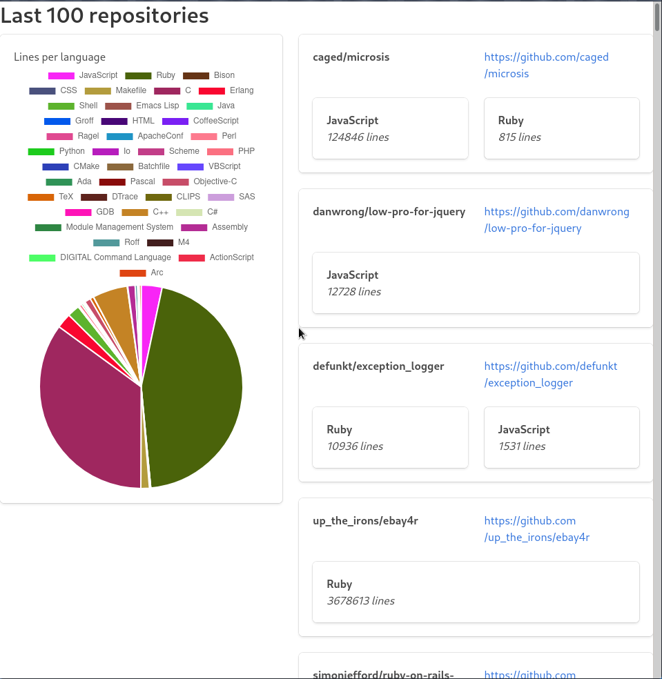

# scalingo_test
Technical test for Scalingo in Go.

# Installation
```go get github.com/TheoEb/scalingo_test```


# How to run
### server
Get a github API key and put it in a file name "github_api.key" at the root of the repo.

```GITHUB_KEY_FILE=<your github api key> ./bin/scalingo_test```

### web client
Go to /scalingo_test/frontend/

```
npm install --silent
npm install react-scripts@3.0.1 -g --silent
PORT=8766 npm start
```

Open a browser on localhost:8766

### With docker

```docker-compose up -d```

Open a browser on localhost:8766

### Screenshot
